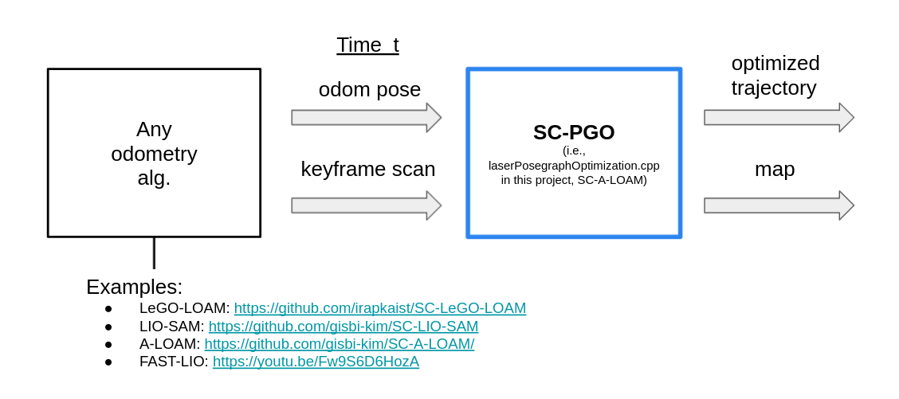
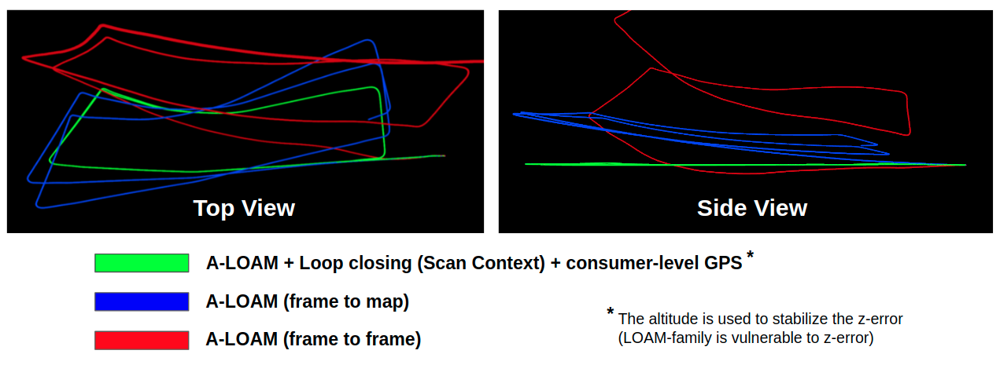
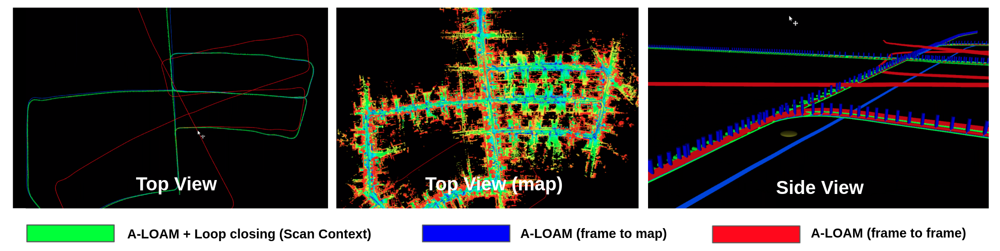
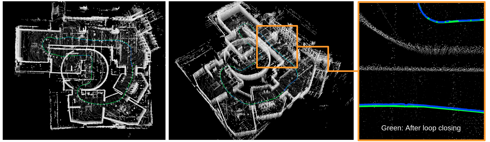
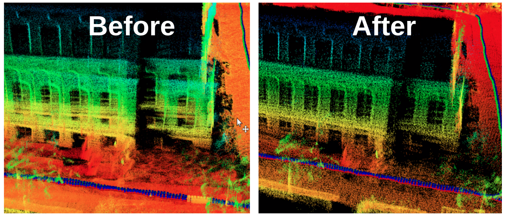
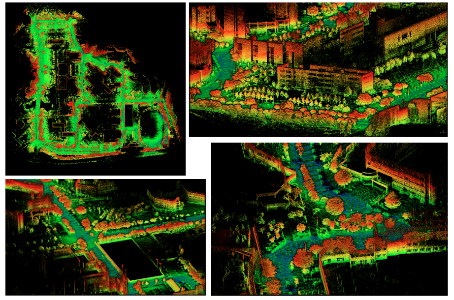

# SC-A-LOAM

## What is SC-A-LOAM? 
- A real-time LiDAR SLAM package that integrates A-LOAM and ScanContext. 
    - **A-LOAM** for odometry (i.e., consecutive motion estimation)
    - **ScanContext** for coarse global localization that can deal with big drifts (i.e., place recognition as kidnapped robot problem without initial pose)
    - and iSAM2 of GTSAM is used for pose-graph optimization. 
- This package aims to show ScanContext's handy applicability. 
    - The only things a user should do is just to include `Scancontext.h`, call `makeAndSaveScancontextAndKeys` and `detectLoopClosureID`. 

## Features 
1.  A strong place recognition and loop closing 
    - We integrated ScanContext as a loop detector into A-LOAM, and ISAM2-based pose-graph optimization is followed. (see https://youtu.be/okML_zNadhY?t=313 to enjoy the drift-closing moment)
2. A modular implementation 
    - The only difference from A-LOAM is the addition of the `laserPosegraphOptimization.cpp` file. In the new file, we subscribe the point cloud topic and odometry topic (as a result of A-LOAM, published from `laserMapping.cpp`). That is, our implementation is generic to any front-end odometry methods. Thus, our pose-graph optimization module (i.e., `laserPosegraphOptimization.cpp`) can easily be integrated with any odometry algorithms such as non-LOAM family or even other sensors (e.g., visual odometry).  
    - <p align="center"></p>
3. (optional) Altitude stabilization using consumer-level GPS  
    - To make a result more trustworthy, we supports GPS (consumer-level price, such as U-Blox EVK-7P)-based altitude stabilization. The LOAM family of methods are known to be susceptible to z-errors in outdoors. We used the robust loss for only the altitude term. For the details, see the variable `robustGPSNoise` in the `laserPosegraphOptimization.cpp` file. 

## Prerequisites (dependencies)
- We mainly depend on ROS, Ceres (for A-LOAM), and GTSAM (for pose-graph optimization). 
    - For the details to install the prerequisites, please follow the A-LOAM and LIO-SAM repositiory. 
- The below examples are done under ROS melodic (ubuntu 18) and GTSAM version 4.x. 

## How to use? 
- First, install the abovementioned dependencies, and follow below lines. 
```
    mkdir -p ~/catkin_scaloam_ws/src
    cd ~/catkin_scaloam_ws/src
    git clone https://github.com/gisbi-kim/SC-A-LOAM.git
    cd ../
    catkin_make
    source ~/catkin_scaloam_ws/devel/setup.bash
    roslaunch aloam_velodyne aloam_mulran.launch # for MulRan dataset setting 
```

## Example Results 

### Riverside 01, MulRan dataset 
- The MulRan dataset provides lidar scans (Ouster OS1-64, horizontally mounted, 10Hz) and consumer level gps (U-Blox EVK-7P, 4Hz) data.
    - About how to use (publishing data) data: see here https://github.com/irapkaist/file_player_mulran
- example videos on Riverside 01 sequence. 
    1. with consumer level GPS-based altitude stabilization: https://youtu.be/FwAVX5TVm04
    2. without the z stabilization: https://youtu.be/okML_zNadhY 
- example result:

<p align="center"></p>

### KITTI 05 
- For KITTI (HDL-64 sensor), run using the command 
    ```
    roslaunch aloam_velodyne aloam_velodyne_HDL_64.launch # for KITTI dataset setting
    ```
- To publish KITTI scans, you can use mini-kitti publisher, a simple python script: https://github.com/gisbi-kim/mini-kitti-publisher
- example video (no GPS used here): https://youtu.be/hk3Xx8SKkv4
- example result: 

<p align="center"></p>

### Indoor
- ScanContext also works at indoor environments (use smaller sc_max_radius value).
- example video: https://youtu.be/Uv6_BRmxJho
- example result: 
<p align="center"></p>

### For Livox LiDAR 
- Scan Context also works for Livox LiDAR data
    - In this example, Scan Context is integrated with FAST-LIO (https://github.com/hku-mars/FAST_LIO).
    - Note: No additional integration effort is required. A user just run seperately FAST-LIO node and SC-A-LOAM's posegraphoptimization.cpp node!
- example video (tutoial and results): https://youtu.be/Fw9S6D6HozA
- example result: 
    <p align="center"></p>

### For Navtech Radar 
- Scan Context also works for Navtech Radar data!
- For the details, please see 
    - https://github.com/gisbi-kim/navtech-radar-slam
        - used the pose-graph optimization node of this repository (SC-A-LOAM)
    - [example video](https://www.youtube.com/watch?v=avtIQ8fesgU&t=128s)

## Utilities

### Data saver and Map construction 
- Similar to the [SC-LIO-SAM's saver utility](https://github.com/gisbi-kim/SC-LIO-SAM#applications), we support pose and scan saver per keyframes. Using these saved data, the map (within ROI) can be constructed offline. See the `utils/python/makeMergedMap.py` and [this tutorial](https://youtu.be/jmR3DH_A4Co). 
- Below is the example results of MulRan dataset KAIST 03's merged map, visualized using CloudCompare ([download the map data here](https://www.dropbox.com/sh/96jrpx3x6hh316j/AACb07kGbocnQWMIpksmU6MQa?dl=0)).  

    <p align="center"></p>

- A user also can remove dynamic points using these saved keyframe poses and scans. See [this tutorial](https://www.youtube.com/watch?v=UiYYrPMcIRU) and our [Removert project](https://github.com/irapkaist/removert).

## Acknowledgements
- Thanks to LOAM, A-LOAM, and LIO-SAM code authors. The major codes in this repository are borrowed from their efforts.

## Maintainer 
- please contact me through `paulgkim@kaist.ac.kr` 

## TODO
- Delayed RS loop closings 
- SLAM with multi-session localization 
- More examples on other datasets (KITTI, complex urban dataset, etc.)
