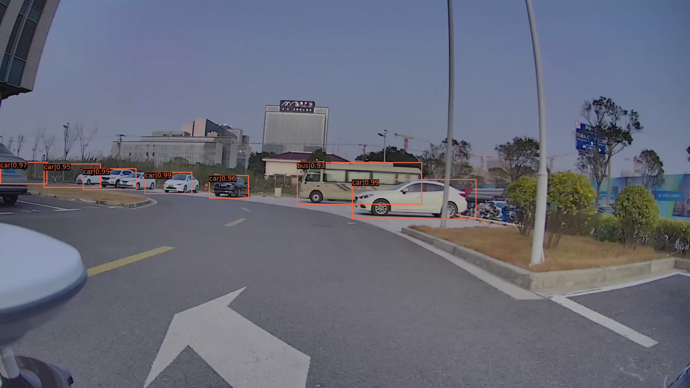

# Moving Object Removal

Please refer to [mmdection](https://github.com/open-mmlab/mmdetection) for the installation process.

We just use the most dummy projection function to remove the LiDAR points that fall into the bounding box with label of movable objects.

| Detection with mmDection           | Remove with Projection            |
| ---------------------------------- | --------------------------------- |
|  |  |
